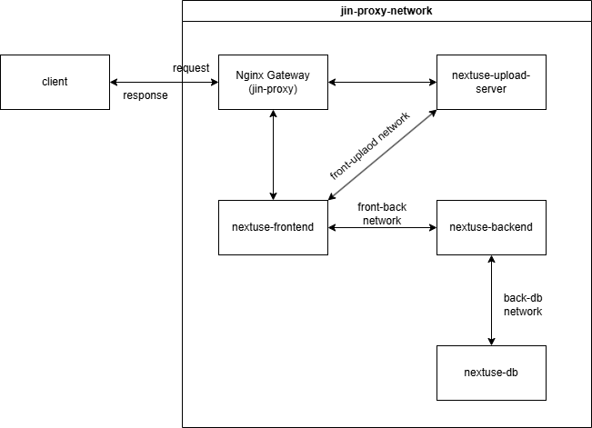

## 네트워크 구성

아래는 Nginx 기반의 네트워크 구성도입니다. 하나의 서버에서 여러 서비스를 운영하기 위해,도메인 기반으로 요청을 분기 처리하는 구조를 사용했습니다.

운영 중인 각 컨테이너는 역할에 따라 별도의 Docker 네트워크로 분리되어 있으며, Nginx는 `jin-proxy` 네트워크를 통해 각 서비스 컨테이너로 트래픽을 라우팅합니다.

s
