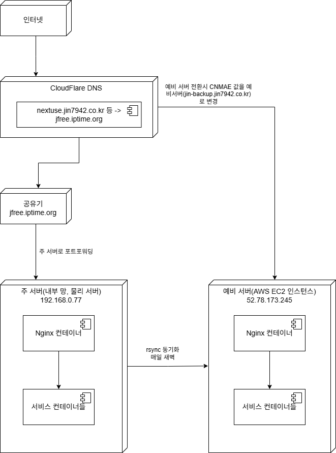
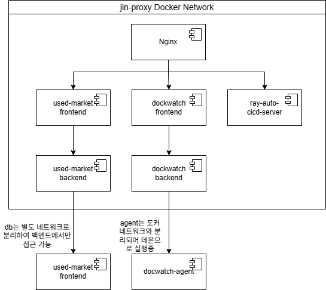

# 1. 개요

본 문서는 현재 사용중인 인프라 구조를 설계하고 구축한 내용을 정리한 문서 입니다. 인프라는 프로젝트 요구에 따라 점진적으로 완성되었으며, 하나의 물리 서버에서 여러 개의 서비스를 배포 하기 위해 Nginx 컨테이너로 도메인 기반 리버스 프록시 구조를 도입하였습니다. 각 서비스는 모두 도커 환경에서 컨테이너로 운영되며, 외부 포트에 바인딩 없이 Nginx 컨테이너를 통해 모든 요청을 처리 합니다.

또한, AWS EC2 인스턴스를 사용하여 Active-Standby 방식의 이중화 구조를 구성 하였으며, 장애 발생 시 장애 발쟁시 복구 및 빠른 전환이 가능하도록 설계하였습니다.

CI/CD 자동화, 리버스 프록시 분기 처리, 예비 서버 전환 스크립트 등 핵심 운영 기능을 포함하고 있습니다.

## 1.1. 사용 기술

Docker, Ubuntu, AWS EC2

## 1.2. 주요 특징

-   Nginx 기반 리버스 프록시
    -   도메인 기반 분기 처리로 하나의 서버에서 다수의 서비스 운영
-   Active-Standby 이중화 구성
    -   AWS EC2 기반 백업 서버 구축, 장애 시 수동 전환 스크립트 제공
-   CI/CD 자동화
    -   [RAY](https://github.com/jin7942/ray) 기반 배포 파이프라인, git push 만으로 자동 배포
-   예비 서버 동기화
    -   rsync를 이용한 주기적 동기화

# 2. 인프라 설계 및 구성

## 2.1. 인프라 구조

배포 인프라는 가정용 공유기를 사용하는 물리 서버 기반의 주 서버와, AWS EC2 인스턴스를 활용한 예비 서버로 구성되어 있습니다.

### 2.1.1. 주 서버

-   내부 망에 위치한 우분투 서버이며, 공유기의 공인 IPv4주소는 DDNS(jfree.iptime.org)를 통해 접근 합니다.
-   Cloudflare DNS에는 서비스 도메인(nextuse.jin7942.co.kr 등)의 CNAME 값을 DDNS 주소로 설정하여 외부 요청을 전달합니다.
-   공유기에서 80번, 443번 포트는 주 서버로 포트포워딩되어 있습니다. 서버로 들어오는 모든 요청은 UFW를 거쳐 Nginx컨테이너로 들어오며, 요청 도메인에 따라 각 컨테이너에 도커 네트워크를 사용하여 요청을 전달 합니다.

### 2.1.2. 예비 서버

-   AWS EC2 인스턴스(t2.micro)로 구성된 예비 서버 입니다.
-   주 서버와 동일한 Nginx 및 서비스 구조를 가지고 있으나, 한정된 자원으로 인해 현재는 [nextuse](https://github.com/jin7942/used_market)의 프론트엔드, 백엔드, DB 컨테이너만 구동됩니다.
-   주 서버와 매일 새벽 3시 rsync를 통해 데이터 동기화가 이루어집니다.
-   장애 발생 시에는 DNS 전환 스크립트를 실행하여 Cloudflare API를 통해 CNAME 값을 백업 서버 도메인(jin-backup.jin7942.co.kr)으로 교체하게 됩니다.

### 2.1.3. 다이어그램



### 2.1.4. 장애 대응 시나리오

주 서버에 장애가 발생한 경우, 빠르게 예비 서버로 트래픽을 전환하기 위한 수동 DNS 전환 절차 입니다. 전환 후 예비 서버는 읽기 전용 모드로 운영되며, DB 쓰기 작업은 제한됩니다. 또한 데이터 동기화 시점에 따라 약간의 데이터 불일치가 발생할 수 있습니다.

1. 장애 감지
    1. 주기적인 상태 점검 또는 접속 실패로 장애 발생 여부 인지
    2. ping, curl, ssh등의 명령어로 서버 접근 불가 확인
2. 예비 서버 상태 확인
    1. ssh로 EC2 백업 서버 접속
    2. ‘docker ps’명령어로 컨테이너 구동 상태 점검
    3. Nginx, 프론트, 백엔드, db 컨테이너가 정상 실행 중인지 확인
3. DNS 전환 수행

    1. 아래 스크립트를 실행하여 Cloudflare의 CNAME 레코드 변경

    ```bash
    bash /srv/deploy/nginx/deploy/script/3.switchDns.sh
    ```

4. 서비스 정상 동작 확인
    1. 서비스 도메인(nextuse.jin7942.co.kr) 이 예비 서버로 연결되었는지 브라우저 및 ‘dig’, ‘curl’등으로 확인
    2. DNS 전파 시간은 평균 1~2분 소요
5. 장애 복구 후 원상 복구

    1. 주 서버 복구 확인
    2. 동일한 스크립트를 재 실행하여 CNAME 레코드를 주 서버로 복구

    ```bash
    bash /srv/deploy/nginx/deploy/script/3.switchDns.sh
    ```

## 2.2. 서버 상세 구성

서버의 사양은 다음과 같습니다.

-   주 서버(데스크탑)
    -   CPU : Intel Core I5-7500
    -   RAM : 40 GB
    -   OS : Ubuntu 24.04.2 LTS
-   예비 서버(AWS EC2 t2.micro 인스턴스)
    -   vCpu : 1
    -   RAM : 1 GB
    -   OS : Ubuntu 24.04.2 LTS

### 2.2.1. 서버 내부 구조

아래 다이어그램은 서버 내에서의 도커 컨테이너 간 통신 구조를 나타냅니다. Nginx 컨테이너만 외부 포트에 노출 시켜 모든 요청은 Nginx를 통해 진입하게 되며, 요청 도메인에 따라 컨테이너로 분기 됩니다.

-   DB컨테이너는 backend-db네트워크로 격리하여 백엔드 컨테이너 에서 만 접근 가능하며, dockwatch-agent는 도커 네트워크와 격리된 상태로 로컬 데몬으로 실행되어 dockwatch-backend 에서만 접근 가능하도록 설계 하였습니다.
-   예비 서버는 Nginx와 used-market 관련 컨테이너만 구동중입니다.



### 2.2.2. Nginx 설정 예시

```bash
# HTTP요청을 HTTPS로 리디렉션
server {
    listen 80;
    server_name dockwatch.jin7942.co.kr;

    limit_req zone=global_limit burst=20 nodelay;

    return 301 https://$host$request_uri;
}

# HTTPS 요청 처리
server {
    listen 443 ssl;
    server_name dockwatch.jin7942.co.kr;

		# 인증서 설정
    ssl_certificate     /etc/nginx/ssl/jin7942.co.kr/fullchain.pem;
    ssl_certificate_key /etc/nginx/ssl/jin7942.co.kr/privkey.pem;
    ssl_protocols TLSv1.2 TLSv1.3;
    ssl_ciphers HIGH:!aNULL:!MD5;

    # 요청 속도 제한
    limit_req zone=global_limit burst=20 nodelay;

		# Docker 내부 DNS 해석용
    resolver 127.0.0.11 valid=5s;

    # 민감 파일 차단
    location ~* /\.(env|git|htaccess|log|bak|ini|swp)$ {
        deny all;
        access_log off;
        log_not_found off;
    }

    # 프론트엔드 요청 프록시
    location / {
        proxy_pass http://dockwatch-frontend:80;
        proxy_set_header Host $host;
        proxy_set_header X-Real-IP $remote_addr;
        proxy_set_header X-Forwarded-For $proxy_add_x_forwarded_for;
        proxy_set_header Authorization $http_authorization;
    }

		# API 요청 프록시
    location /api/ {
        proxy_pass http://dockwatch-backend:3738/api/;
        proxy_set_header Host $host;
        proxy_set_header X-Real-IP $remote_addr;
        proxy_set_header X-Forwarded-For $proxy_add_x_forwarded_for;
    }

		# WebSocket 프록시
    location /ws/ {
        proxy_pass http://dockwatch-backend:3738/ws/;
        proxy_http_version 1.1;
        proxy_set_header Upgrade $http_upgrade;
        proxy_set_header Connection "upgrade";
        proxy_set_header Host $host;
        proxy_set_header X-Real-IP $remote_addr;
        proxy_set_header X-Forwarded-For $proxy_add_x_forwarded_for;
    }
}
```

위 내용은 Nginx 설정 중 [dockwatch](https://github.com/jin7942/dockwatch) 프로젝트에 해당하는 설정입니다.

-   HTTP 요청은 HTTPS로 자동 리디렉션 합니다.
-   limit_req 설정을 통해 초당 요청 수를 제한 하여 무분별한 요청을 방지하며, .env, .git 등 민감한 파일에 대한 접근을 차단 하였습니다.

### 2.2.3. 방화벽(UFW) 설정 요약

-   기본 정책: 모든 인바운드 트래픽 차단
-   허용 포트: 80, 443
-   기타 포트는 SSH 접속용 외 모두 차단 및 내부 망에서만 접근 가능하도록 설정
-   Nginx 컨테이너 외의 컨테이너는 내부 통신만 허용

### 2.2.4. 예비 서버 동기화 스크립트

-   매일 새벽 3시 스크립트 실행
-   대상 : 도커 이미지, 업로드 파일, DB 데이터 등

## 2.3. 디렉터리 구조

```bash
.
├── README.md
├── conf.d                                  // 프로젝트별 설정 모음
│   ├── dockwatch.conf
│   ├── nextuse.conf
│   └── ray-auto-deploy-server.conf
├── deploy                                  // docker-compose.yml 모음
│   ├── dockwatch
│   │   └── docker-compose.yml
│   ├── jin-gateway
│   │   └── docker-compose.yml
│   ├── ray-auto-deploy-server
│   │   └── docker-compose.yml
│   ├── script                              // 운영 관련 스크립트 모음
│   │   ├── 0.sysDuplexing.sh               // 주-예비 동기화 스크립트
│   │   ├── 1.redeploy.sh                   // 예비 서버 컨테이너 재 실행 스크립트
│   │   ├── 2.showDns.sh                    // 현재 DNS 조회 스크립트
│   │   ├── 3.switchDns.sh                  // DNS 전환 스크립트
│   │   ├── start
│   │   │   └── 0.startAllService.sh        // 컨테이너 전체 실행 스크립트
│   │   └── stop
│   │       └── 0.stopAllService.sh         // 컨테이너 전체 중지 스크립트
│   └── usedmarket
│       ├── backup                          // 예비 서버용 설정
│       │   └── docker-compose.yml
│       └── docker-compose.yml
├── docker-compose.yml                      // nginx 도커 설정파일
└── nginx.conf                              // nginx 기본 설정
```
